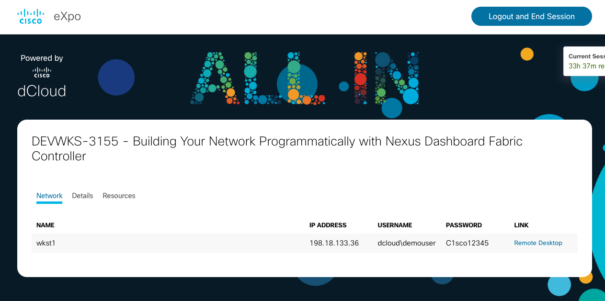

# Environment Setup and Tutorial

Let's get started with the hands on portion of this workshop.  This section of the lab will accomplish the following 3 tasks:

- Check out the latest software for the workshop into your cloud instance, via the web browser terminal window
- Connect your workshop cloud instance, via the web browser terminal window, to your dCloud instance using VPN

## Environment Setup

To ensure we have the latest version of the workshop repository, clone the GitHub repository for this workshop:

```bash
cd ${HOME}/src
git clone https://github.com/eti-tme-tim/DEVWKS-3155-CLAMS23
cd DEVWKS-3155-CLAMS23
```

Next, build the Python virtual environment, install Ansible, and install some Python utilities.

```bash
source setup-python.sh
```

## dCloud Session Checkout

The NDFC environment for this session is hosted by dCloud's eXpo service. To connect our session, you need to navigate to the following URL:

[http://cs.co/devwks-3155-dcloud](http://cs.co/devwks-3155-dcloud)

Click the explore button on the DEVWKS-3155 session, enter your email address, and accept the terms (see the following two screens):


Once you've completed those tasks, you'll be allocated one of the existing sessions for this workshop.  As you can see from the screenshot below, you have the ability to launch a remote desktop into the session (which we will do later) using the link at the far right.



Do not close this window during the workshop as you will lose access to the dCloud backend and any progress that you have made.  There are a few extra dCloud sessions in case of issues but you would be starting over if you had to restart.

So, you should have two browser windows open at this point:  this learning lab and the dCloud eXpo information.

## Workshop VPN Connection

In this section, we are going to connect the learning lab session (the web browser hosting these documents and the terminal in the lower right) to that dCloud instance through VPN.

You'll need the VPN connection information from the dCloud eXpo web page. Click on the "Details" tab to get that information (look like this):


(**DO NOT USE THE CREDENTIALS** from the above image as they will not work.  Please use the ones you find in YOUR specific eXpo browser.)

You can use the "two boxes" logo indicated by the arrow to copy the text into the clipboard for easy pasting into your terminal (to the lower right).

In that Learning Lab terminal, you'll need to define the following 3 environment variables **based on the credentials provided to you**.  The environment variable commands look like this (you need to insert the values from your eXpo session):

```
# Set the VPN credentials
export VPN_SERVER=
export VPN_USERNAME=
export VPN_PASSWORD=
```

Based on the screenshot above, the example exports would look like this (again, don't use these values, use your session values):

```
export VPN_SERVER=https://dcloud-rtp-anyconnect.cisco.com
export VPN_USERNAME=v2937user1
export VPN_PASSWORD=3c3a1
```

Once defined, you simply start the VPN via:

```
# Fire it up
startvpn.sh &
```

At this point, we can test the VPN connection into your specific lab environment by attempting to log into the NDFC appliance.  Please note: we are only going to **attempt the connection**, we will **not fully log in** and will be aborting it via ctrl-c.

```bash
ssh rescue-user@198.18.134.200
```

```
The authenticity of host '198.18.134.200 (198.18.134.200)' can't be established.
RSA key fingerprint is SHA256:QGN1tOCXOeidm6pwQB9DEm0H/2TQCxysqEbWaPfGR3g.
Are you sure you want to continue connecting (yes/no/[fingerprint])?
```

If you get the specified output, your VPN connections are working. Simply hit Ctrl-C to abort the connection attempt to move on to the next step in the workshop. Otherwise, we can look at the log file to see if there's anything revealing about why the VPN tunnel is not working:

```bash
# SKIP THIS STEP IF YOUR VPN IS WORKING
cat /var/log/openconnect/openconnect.log
```

## One final set of environment variables

Click the icon below to run the following commands in the terminal:

```bash
export NDFC_HOST=198.18.134.200
export NDFC_USER=admin
export NDFC_PASS=C1sco12345
```

These environment variables will be used by a Python utility that we will use if parts of the lab should not cooperate!

## Summary

In this setup, you'll have:

- Checked out the latest software for the workshop into your cloud instance, via the web browser terminal window
- Connected your laptop via VPN to your dCloud instance
- Connected your workshop cloud instance, via the web browser terminal window, to your dCloud instance

