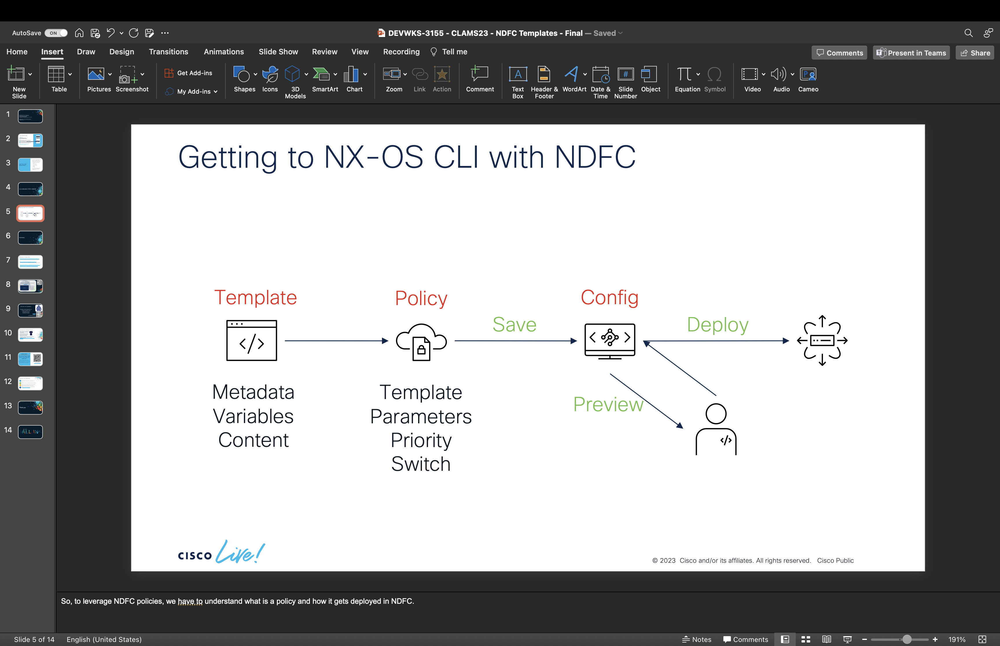

# Templates

In this section we are going to:

- Learn about the different types of templates
- Learn about how templates are converted to policies

## Template Overview

The power of NDFC - especially with regards to VXLAN EVPN fabrics - are the templates. Unlike basic config snippet templates, many of the templates within NDFC are actually Python-like entities that can perform complex configuration based on a number of factors (fabric settings, switch role, etc.).

For fabric templates, the fabric type will determine the wide range of settings necessary to allow the fabric to function. A VXLAN fabric type has many settings related to the underlay while a classic Ethernet fabric has very few settings (most related to global switch settings).  External or LAN Classic fabric types have much less structured automation - and therefore fabric settings - because they handle a wider variety of topologies and configurations.

The lifecycle within NDFC to go from a template to switch configuration looks something like this:



## Kinds of Templates

Beyond the fabric type, most templates relate to configuration applied to switches. There are very simple configuration templates, like the templates to enabled NX-OS features (feature_interface_vlan_11_1):

```
feature interface-vlan
```

Or, templates that have a typical config snippet with but permit variable substitution (base_ospf):

```
##
##template content

router ospf $$OSPF_TAG$$
  router-id $$LOOPBACK_IP$$

##

```

Or, more flexible templates have some built-in Python like logic (create_vlan):

```
##template content

vlan $$VLAN$$

if ($$NAME$$ != \"\") {
  name $$NAME$$
}

if ($$MODE$$ == \"FABRICPATH\") {
  mode fabricpath
}

if ($$VNI$$ != \"\") {
  vn-segment $$VNI$$
}
```

## Template terminology

For the purposes of this workshop as well as working with advanced configuration automation with NDFC, it's important to understand the general structure of the templates:

- **parameters**: the variables and their values that are populated to create a specific policy for a switch
- **content**: the actual CLI configlet or Python is used to generate the final NX-OS configuration.

It's a bit of a mind bender but what you and I might consider a configuration template really is the **content** of an NDFC template (which is metadata, parameters, and the content to define a particular policy).

A large portion of our activity in this workshop will be finding the NDFC template, extracting the parameters needed to configure the desired features, and then creating the policy based on the template name and parameter values.

## Policies

Policies are simply the combination of a template, parameter data, and a switch to which we apply it. It's critically important to note that a policy is specific to a single, individual switch. Even if you are creating VLAN 10 on all switches, you'll need a separate policy for each and every switch - with the identical template name and identical parameter data.

## Policy Metadata

Policy ID - String to Uniquely ID the policy
Description - (optional) Description for the policy entry (e.g. 'Ansible Generated')

Switch Serial Number - Unique Identifier for Switch to which this policy is bound
Entity Name - (SWITCH, Ethernet1/1)
Entity Type - (SWITCH, INTERFACE)

Content Type - derives from Template Content Type (TEMPLATE_CLI, PYTHON)
Source - NDFC Entity generating the policy (UNDERLAY, LINK, etc)

Priority - NDFC construct to sort the order in which the generated CLI is applied. I've included a suggestion that I use as a rule of thumb for my labs and demos. No one other than myself endorses these so no implied warranty of any kind.

 - 100: features
 - 200: VLANs
 - 300: Routed Interfaces (and SVIs)
 - 400: Switch Interfaces
 - 500: Generic policy (default)
