# Example: Create VLAN via NDFC templates

In creating a VLAN, as a network engineer, we know there is one required piece of information (the VLAN ID number) and one optional piece of information (name of the VLAN).  That NX-OS configuration would look something like this:

```
vlan 100
  name Demo_VLAN
```

## Finding the template in NDFC

For this section of the exercise, we will use the remote desktop capabilities in the dCloud eXpo browser.

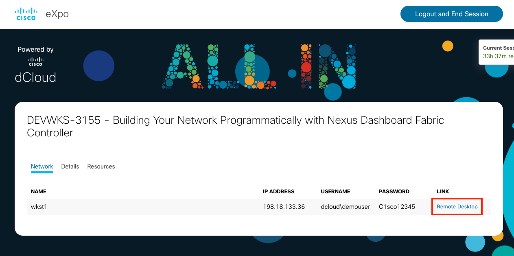

When Guacamole (the web browser based RDP client launches), you'll see a standard Windows desktop:

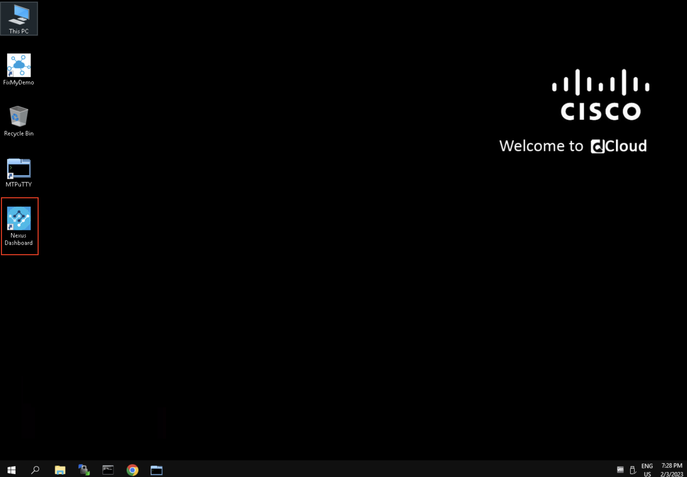

Double click on the highlighted icon above to launch Nexus Dashboard Fabric Controller and log in with the following NDFC dCloud credentials:
- user: admin
- password: C1sco12345

Once logged in, navigate to the templates area of fabric controller, via:
- Services->Fabric Controller
- Operations->Templates

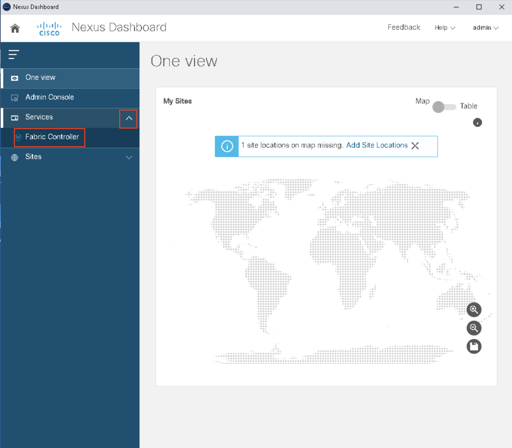

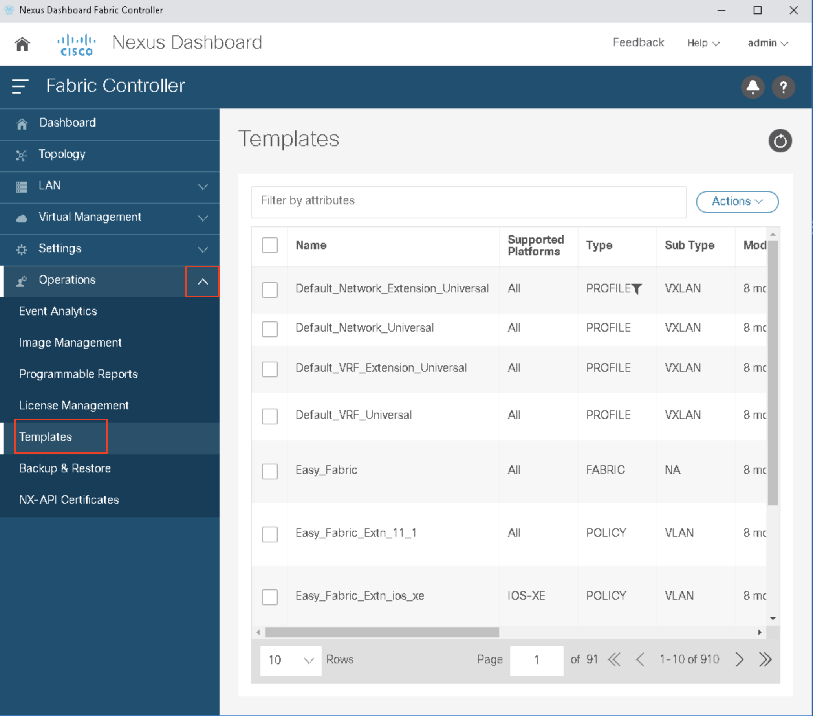

Search for template names containing "vlan" in the "Filter by attributes" menu. If you are new to NDFC, the method of specifying the search requires care:

- Name (enter)
- contains (enter)
- vlan (enter)

Check the box for the **create_vlan** template.  Under Actions, select "Edit template content".  At the top, you'll see the template variables (your key value parameters that are used to create policies) and the template content which forms the NXOS CLI that is generated from those variables (reproduced below):

```
##template content

vlan $$VLAN$$

if ($$NAME$$ != \"\") {
  name $$NAME$$
}

if ($$MODE$$ == \"FABRICPATH\") {
  mode fabricpath
}

if ($$VNI$$ != \"\") {
  vn-segment $$VNI$$
}
```

We would have to create a **policy** in the following manner:

- Uses template named "create_vlan"
- Customized by the following parameters:
  - VLAN=100
  - NAME=Demo_VLAN
  - MODE=CE
- Has configuration priority "200"
- Is applied to switch "spine-1", identified by IP "198.18.4.201"

Cancel out of the Edit Template view.

## Applying the policy in NDFC

This section is for your information (think "Hidden Slides" from a normal breakout session).

If you connection to dCloud is behaving, you can deploy VLAN 100 to the spines using the following workflow:

Fabrics->classic-lan-fabric (double click on the link)

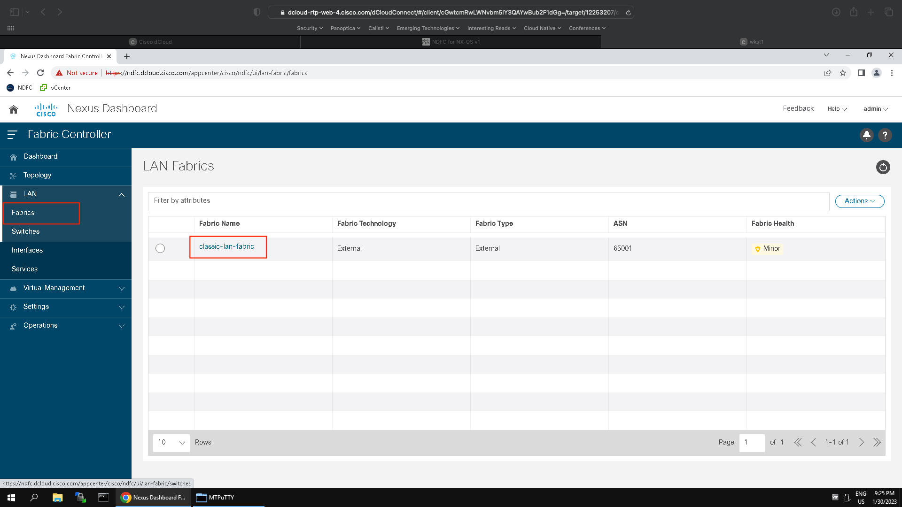

Policies->Actions->Add Policy

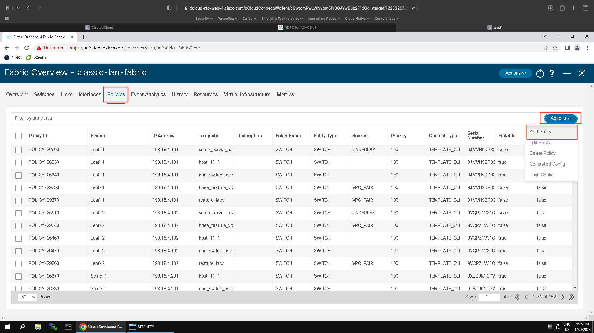

Select Switches: Spine-1,Spine-2

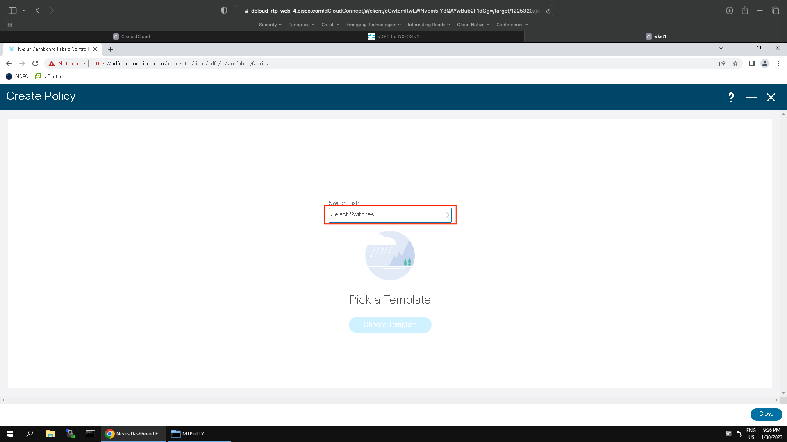
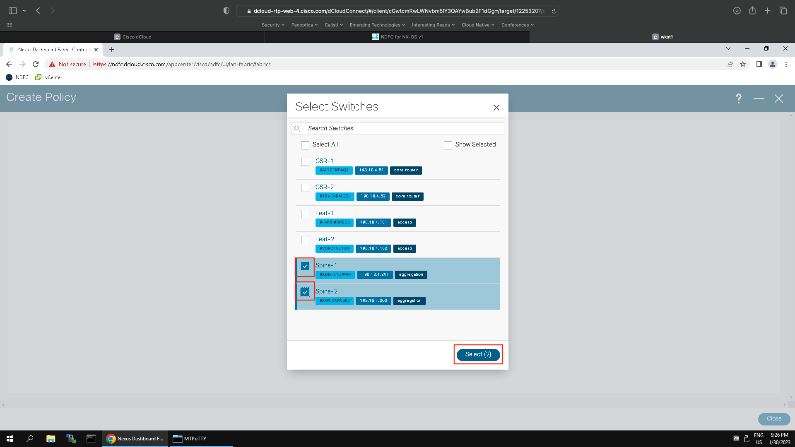

Choose Template: create_vlan

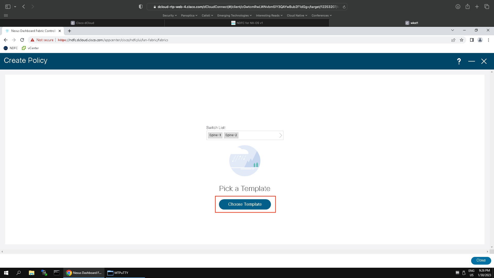
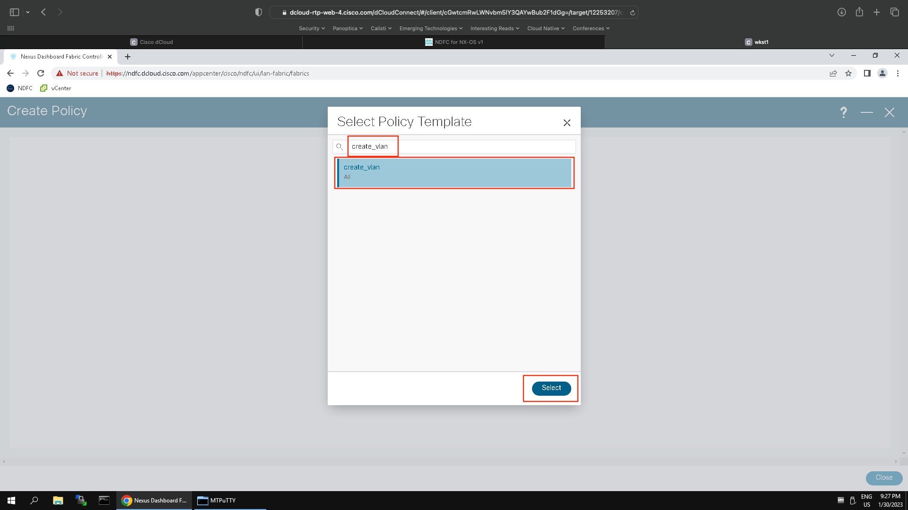

Fill out form, hit save

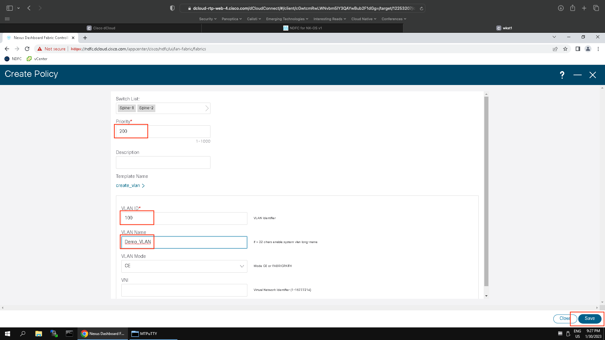

Recalculate and Deploy

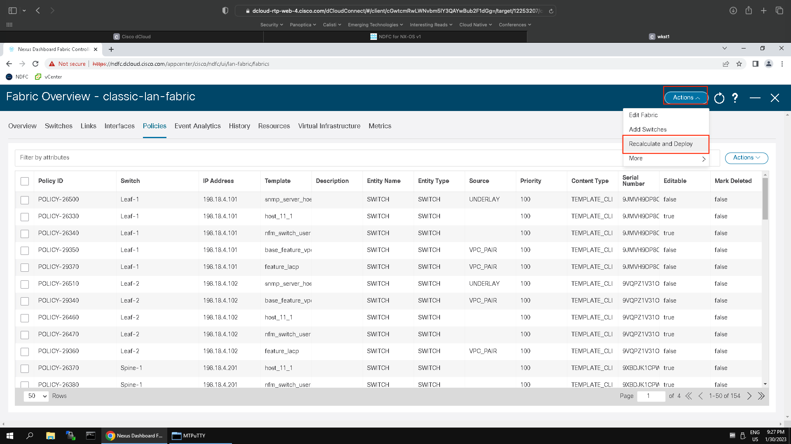
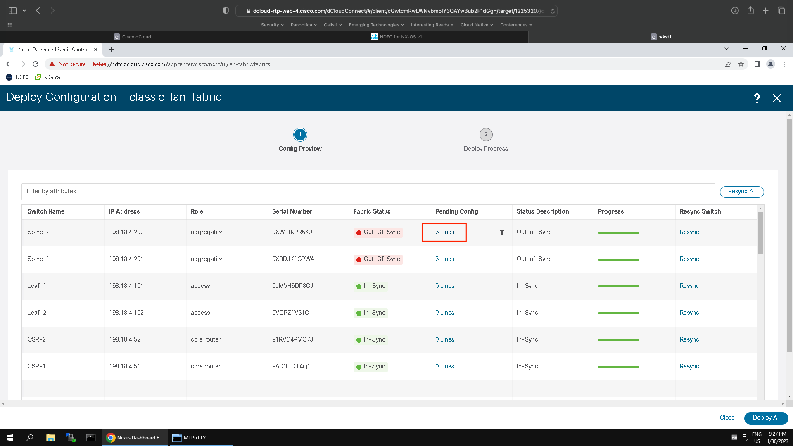

View Differences

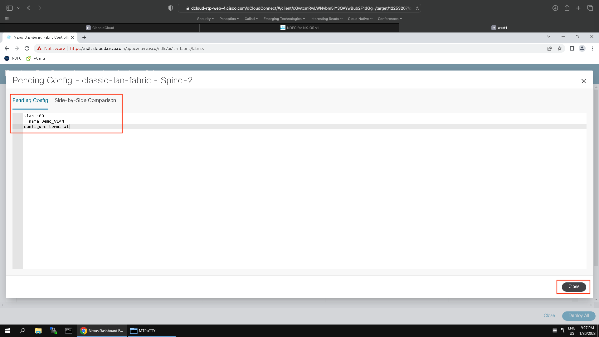

Close Pending Config, Deploy Changes

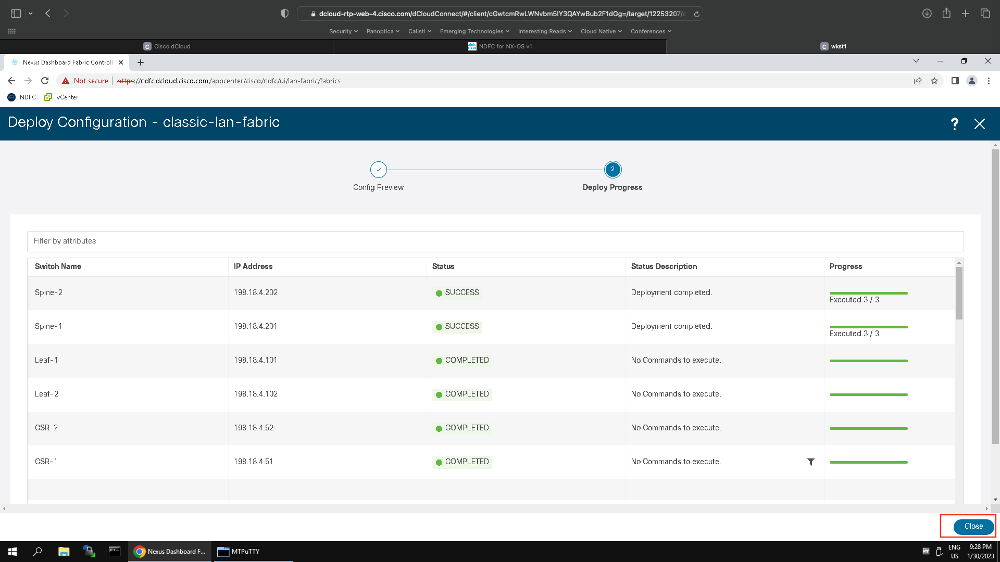

