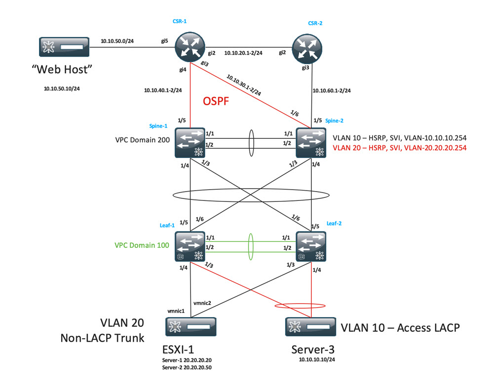

# Workshop Challenge

We are going to configure the "spines" of our network to run OSPF and peer with the northbound routers in our network.  That network is shown:



It's not indicated on the drawing, but the management IP addresses (which we'll use for router IDs in OSPF) for the elements above are:

- CSR1: 198.18.4.51
- CSR2: 198.18.4.52
- Spine-1: 198.18.4.201
- Spine-2: 198.18.4.202
- Leaf-1: 198.18.4.101
- Leaf-2: 198.18.4.102

As with any automation exercise, we have to know what you are automating, namely:

- how do I configure OSPF to run on NX-OS?
- how do I establish a neighbor adjacency with another router in NX-OS?

## Establish the routing protocol

From a fresh install to deploying the OSPF process on a switch, we need an OSPF process id (3155, for this workshop) and a router-id (switch management IP).  Using that information the NX-OS CLI we need to deploy on the switch is:

```
feature ospf

router ospf 3155
  router-id 198.18.4.101

```

## Establish the routing adjacency

In NX-OS, I enable OSPF on an interface so that it will attempt to form those adjacencies with a neighbor router.  To successfully neighbor, I need to identify on that interface the OSPF process id (3155) and the OSPF area that interface belongs (0.0.0.0, in this workshop) - which of course must match the area on the neighbor router interface.  From that information, for a given interface, the NX-OS CLI we need to deploy on the switch is:

```
interface Ethernet1/1
  ip route ospf 3155 area 0.0.0.0
```

Of course, the required ip address, switchport mode (routed), and optional settings like description are not included above. We will need those, however, for our Ansible.

## Automating It All

With Ansible, there are two modules that we will leverage to deploy these configuration settings.

### System Settings

System wide settings, such as routing process configuration, are typically deployed directly via templates and policies. Deploying a policy in NDFC using Ansible leverages the **dcnm_policy** module, documented in the [Ansible Collection](https://github.com/CiscoDevNet/ansible-dcnm/blob/main/docs/cisco.dcnm.dcnm_policy_module.rst), and has the Ansible YAML structure that resembles this: 

```yaml
- name: "Ansible task name"
  dcnm_policy:
    fabric: "NDFC FABRIC NAME"
    deploy: boolean
    state: merged
    config:
      - name: "NDFC template name"
        priority: integer
        create_additional_policy: boolean
        policy_vars:
          TMPL_VAR1: TMPL_VAL1
          TMPL_VAR2: TMPL_VAL2
          TMPL_VAR3: TMPL_VAL3
      - switch:
        - ip: "switch1 mgmt IP"
        - ip: "switch2 mgmt IP"
```

Even without knowing Ansible that deeply, the great thing about Infrastructure as Code (IaC) YAML is that you can reasonably make out what values you need and how they apply to the task at hand.

### Interface Settings

Interface settings are almost universally applied to the interface via the interface configuration module [dcnm_interface](https://github.com/CiscoDevNet/ansible-dcnm/blob/main/docs/cisco.dcnm.dcnm_interface_module.rst). Primarily, this module works best with physical interfaces but there is some support for various logical/virtual interfaces.  The Ansible interface YAML has the following structure:

```yaml
- name: "Ansible task name"
  dcnm_interface:
    fabric: "NDFC FABRIC NAME"
    check_deploy: boolean
    state: merged
    config:
      - name: "Interface name"
        deploy: boolean
        switch:
          - "switch1 mgmt IP address"
          - "switch2 mgmt IP address"
        type: "interface type (e.g. eth)"
        profile:
          admin_state: boolean
          mode: "routed"
          mtu: "must be a string number"
          ipv4_addr: "interface IP number"
          ipv4_mask_len: "interface mask length"
          cmds:
            - "list of free form configuration lines"
```

**dcnm_interface** is a bit more complicated for an NDFC Ansible module because you can leverage it in a few ways:

- A single task on a single switch
- A single configuration pattern for multiple switches: e.g port channel trunk interface settings.
- A single related action but configured differently on multiple switches: e.g. routed interfaces to the same upstream switch where each interface has a necessarily different IP address

In our examples, we will leverage this last pattern. Let's jump to the next section and work on defining the router process on each spine switch.

## Summary

You are all set to work on the challenge!
