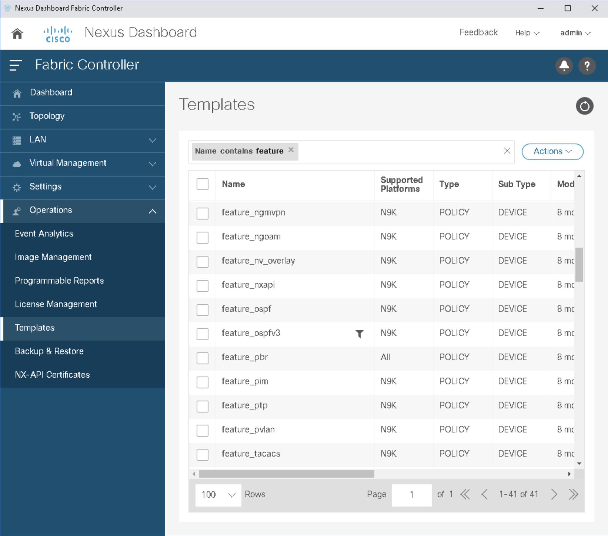
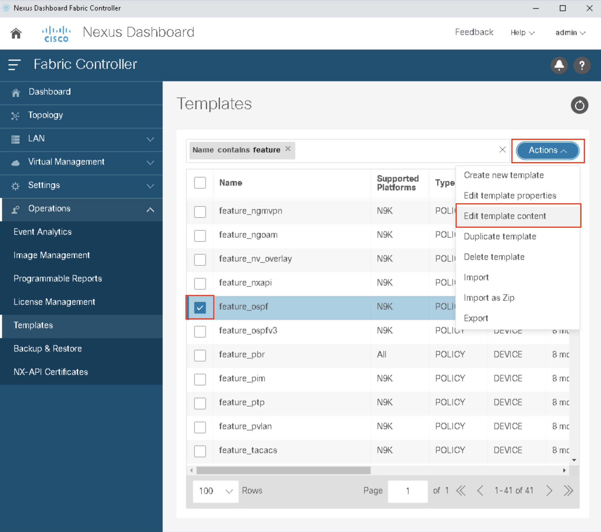
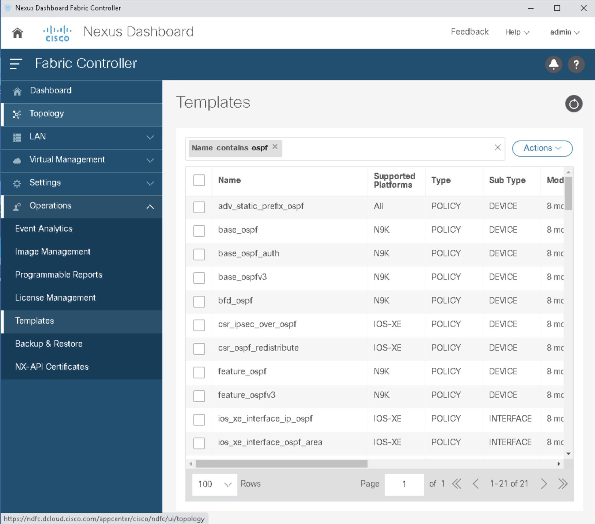
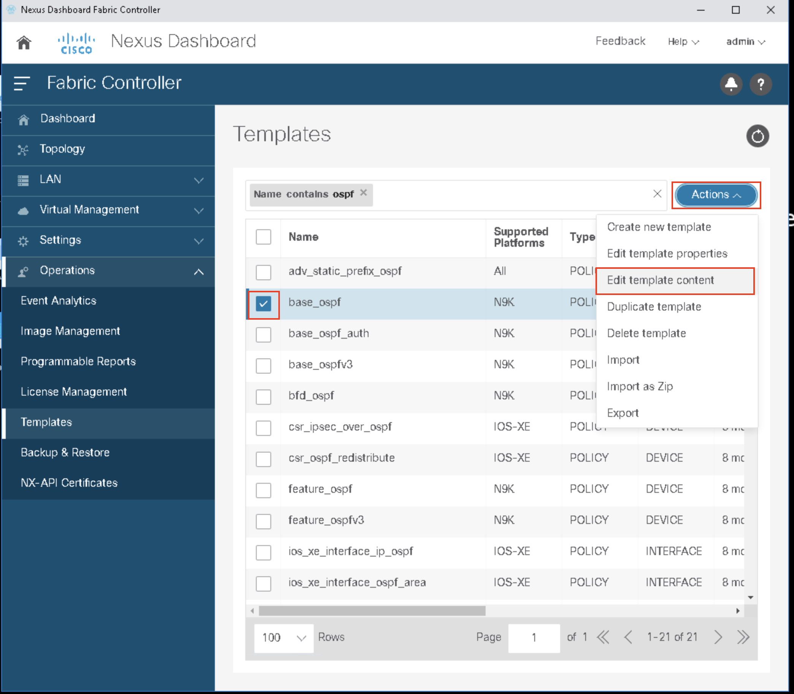
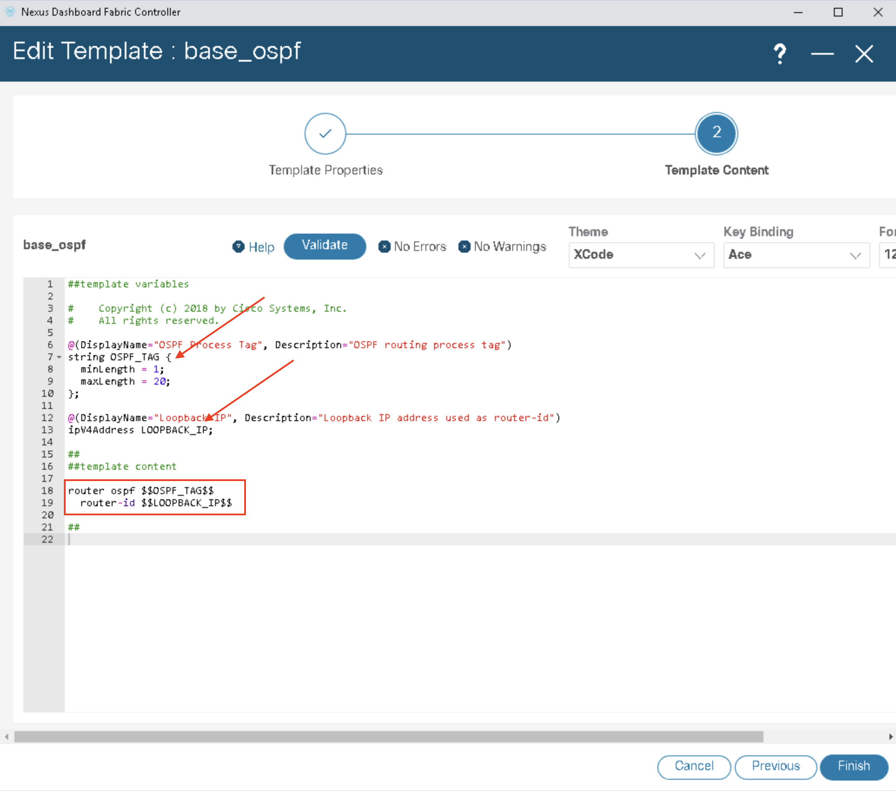

# Routing Process Automation

A quick review of what we know:

- NX-OS commands needed for your switches
- How to navigate NDFC (both UI and API) to find the correct templates to deploy
- How to review NDFC templates to find the parameters needed to generate policy
- Ansible YAML templates

Your network engineering automation task in this section:

- Enable the OSPF feature in NXOS
- Configure the OSPF routing process and specifying a router-id.

You'll complete the tasks in this section by editing some Ansible YAML

## Review the Ansible

In the editor on the right, navigate to the Ansible directory:

```
src/DEVWKS-3155-CLAMS23/ansible
```

In this folder, we'll find a partial playbook to configure the OSPF routing protocol: **01-routing-protocols.yaml**

The YAML file has a few sections:

- Ansible variables for the task at hand
- Variables that you will config in the playbook
- Ansible tasks to make the changes

In all the YAML in this workshop, any variables that have a "site1" prefix should not be modified. Those are defined specific for the dCloud instance on your behalf.

### Enable OSPF Feature

In the Ansible task below that deploys a NDFC policy, the entire task is built out for you - you simply must define the appropriate variables to correctly build the "feature ospf" policy.

```yaml
    - name: Enable OSPF on both spines
      dcnm_policy:
        fabric: "{{ site1.fabric_name }}"
        deploy: no
        state: merged
        config:
          - name: "{{ enable_feature_template_name }}"
            priority: "{{ enable_feature_priority }}"
            create_additional_policy: false
          - switch:
            - ip: "{{ site1.spine1.ip }}"
            - ip: "{{ site1.spine2.ip }}"
```

### Enable OSPF Process

Similarly, we show the OSPF process configuration policy Ansible module and how to configure it below.  As mentioned in the previous section, this policy configuration style deploys related configurations (router ospf 3155/router-id IP) across multiple routers. However, since each router-id is unique to each router, we have to itemize that information as shown below.

```yaml
    - name: Enable OSPF Process on both routers
      dcnm_policy:
        fabric: "{{ site1.fabric_name }}"
        deploy: no
        state: merged
        config:
          - switch:
            - ip: "{{ site1.spine1.ip }}"
              policies:
                - name: "{{ ospf_process_template_name }}"
                  priority: "{{ ospf_process_priority }}"
                  create_additional_policy: false
                  policy_vars: "{{ spine1_policy_vars }}"
            - ip: "{{ site1.spine2.ip }}"
              policies:
                - name: "{{ ospf_process_template_name }}"
                  priority: "{{ ospf_process_priority }}"
                  create_additional_policy: false
                  policy_vars: "{{ spine2_policy_vars }}"
```

Both of those templates are completed with the definition of variables that are found near the top of the Ansible playbook, specifically the section shown below:

```yaml
    # WORKSHOP TO-DOs
    enable_feature_template_name: CHANGE_ME
    enable_feature_priority: 100
    ospf_process_template_name: CHANGE_ME
    ospf_process_priority: 200

    spine1_policy_vars:
      OSPF_TAG: CHANGE_ME
      LOOPBACK_IP: CHANGE_ME
    spine2_policy_vars:
      OSPF_TAG: CHANGE_ME
      LOOPBACK_IP: CHANGE_ME
```

So the summary of the tasks at hand as an Ansible automation engineer are:

- identify the template to enable the OSPF feature, replacing **CHANGE_ME**
- identify the template to configurat the OSPF routing process, replacing **CHANGE ME**
- taking the known values for the OSPF TAG (process ID) and LOOPBACK_IP (router-id) to replace the respective **CHANGE_ME** entries.

For your convenience, the management IP addresses are listed below (router ID values!):

- CSR1: 198.18.4.51
- CSR2: 198.18.4.52
- Spine-1: 198.18.4.201
- Spine-2: 198.18.4.202
- Leaf-1: 198.18.4.101
- Leaf-2: 198.18.4.102

The OSPF router process should have an ID of **3155** 

Ready?

## Feature Enablement

As we have seen, the template names are easily guessable in NDFC. Switch over to your dCloud eXpo browser with the NDFC window opened in it.  Navigating to Operations->Templates, let's search for templates with feature in the name (hint, we just did this at the end of the last session):



We can examing the template **feature_ospf** by checking the box and, under the actions menu in the upper right, select "Edit template content" as indicated below:



In looking at the template, and recalling a little NX-OS networking engineering, we shouldn't be surprised at all to find that this policy is simply the NX-OS CLI command:

```
feature ospf
```

No variables are needed because it's a straight forward fixed template.

Now, let's go back to Learning Lab web browser to configure out Ansible playbook (01-routing-protocols.yaml).  Let's open that  to deploy this template as a policy for our two spine switches.  Update the following entry to read:

```yaml
    enable_feature_template_name: feature_ospf
```

This completes task one of this module.

## Routing Process

By now, you are getting to be an expert at finding NDFC Templates. Let's return to the dCloud eXpo browser and NDFC to conduct a search for **ospf**:



While the choice isn't quite so obvious, the correct template is **base_ospf**, which we can verify as the correct choice by going into the template via "Edit template contents":



This template one of the base templates with simple variable substituion.  At the top, the arrows point to the two parameters in the template that need values to become policies. At the bottom, in the box, is the content itself:




Now let's return to our Ansible playbook (01-routing-protocols.yaml)in the upper right.  Let's update the Ansible variable to reflect our new discovery:

```yaml
    ospf_process_template_name: base_ospf
```

Task two for the module is complete!

The last task is to update the parameters needed for policies applied to spine1 and spine2 (recall, a policy is a template with defined parameters applied to a switch!).  To complete task three, make the following changes to **01-routing-protocols.yaml**

```yaml
    spine1_policy_vars:
      OSPF_TAG: 3155
      LOOPBACK_IP: 198.18.4.201
    spine2_policy_vars:
      OSPF_TAG: 3155
      LOOPBACK_IP: 198.18.4.202
```

With the file updated, all you need to do now is run the Ansible playbook in the learning lab terminal in the lower right by click on the icon in the text box below:

```bash
cd ${HOME}/src/DEVWKS-3155-CLAMS23/ansible
ansible-playbook 01-routing-protocols.yaml
```

Your expected output should look something like this:

```
[WARNING]: Collection cisco.dcnm does not support Ansible version 2.13.7

PLAY [dcnm] ***********************************************************************************************************************

TASK [Enable OSPF on both spines] *************************************************************************************************
changed: [dcloud_dcnm]

TASK [Enable OSPF Process on both routers] ****************************************************************************************
changed: [dcloud_dcnm]

TASK [Save changes to "classic-lan-fabric"] ***************************************************************************************
ok: [dcloud_dcnm]

TASK [Deploy changes to "classic-lan-fabric"] *************************************************************************************
ok: [dcloud_dcnm]

PLAY RECAP ************************************************************************************************************************
dcloud_dcnm                : ok=4    changed=2    unreachable=0    failed=0    skipped=0    rescued=0    ignored=0   

```

Hit "Next" to continue on to configuring the adjacencies!
