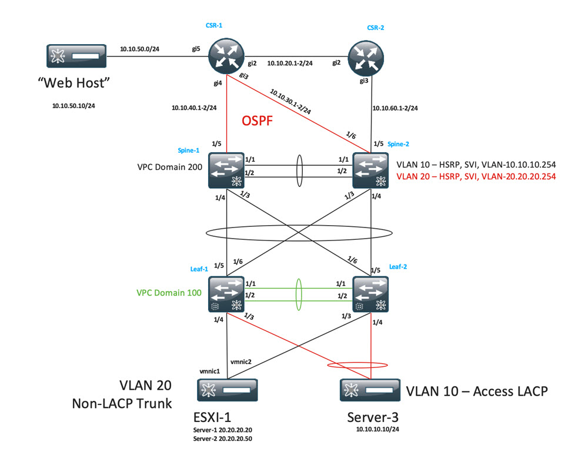

# Neighbor Adjacency Automation

This final task requires us to enable the OSPF process on the interfaces connected to the upstream routers.  As a reminder of our topology, I've included it below:



As discussed in the [challenge](./04-challenge.md) section, we simply have to configure the NX-OS interfaces to:

- be routed interfaces
- assign the interfaces an IP address
- add the correct OSPF command to the interface

## Review the Ansible

Let's now navigate to the specific Ansible playbook to configure our environment.  In the upper right editor window, find the src/DEVWKS-3155-CLAMS22/ansible/02-routing-neighbors.yaml file and open it (by clicking on it in the directory tree).

The task for configuring the interface is reproduced below:

```yaml
    - name: Create L3 Routed Link between Spine 1 and CSR 1
      dcnm_interface:
        fabric: "{{ site1.fabric_name }}"
        check_deploy: yes
        state: merged
        config:
          - name: "{{ spine1_csr1_interface_name }}"
            deploy: yes
            switch:
              - "{{ site1.spine1.ip }}"
            type: eth
            profile:
              admin_state: yes
              mode: "routed"
              mtu: "9216"
              ipv4_addr: "{{ spine1_csr1_interface_ip_address }}"
              ipv4_mask_len: "{{ spine1_csr1_interface_prefix_length }}"
              cmds:
                - "{{ freeform_config_enable_ospf_on_interface }}"
```

All the components to configure are defined in variables at the top:

```yaml
    spine1_csr1_interface_name: CHANGE_ME
    spine1_csr1_interface_ip_address: CHANGE_ME
    spine1_csr1_interface_prefix_length: 24

    spine2_csr2_interface_name: CHANGE_ME
    spine2_csr2_interface_ip_address: CHANGE_ME
    spine2_csr2_interface_prefix_length: 24

    freeform_config_enable_ospf_on_interface: CHANGE_ME
```

From the drawing, we can identify the interface names as **Ethernet1/5**.

It's not 100% clear from the drawing but:

- The Spine-1 interface IP address should be **10.10.40.2/24** 
- The Spine-2 interface IP address should be **10.10.60.2/24**

And, of course, from the [challenge](./04-challenge.md) discussion, the interface configuration command to enable OSPF on it is **ip router ospf 3155 area 0.0.0.0**.

With all this information, edit the **02-routing-neighbors.yaml** file in the upper right to look like the following:

```
    spine1_csr1_interface_name: "Ethernet1/5"
    spine1_csr1_interface_ip_address: 10.10.40.2
    spine1_csr1_interface_prefix_length: 24

    spine2_csr2_interface_name: "Ethernet1/5"
    spine2_csr2_interface_ip_address: 10.10.60.2
    spine2_csr2_interface_prefix_length: 24

    freeform_config_enable_ospf_on_interface: "ip router ospf 3155 area 0.0.0.0"
```

Once completed, you'll be able to run the Ansible playbook to configure the interfaces:

```bash
cd ${HOME}/src/DEVWKS-3155-CLAMS23/ansible
ansible-playbook 02-routing-neighbors.yaml
```

A successful run of Ansible against NDFC should produce the following output:

```
[WARNING]: Collection cisco.dcnm does not support Ansible version 2.13.7

PLAY [dcnm] *************************************************************************

TASK [Create L3 Routed Link between Spine 1 and CSR 1] ******************************
changed: [dcloud_dcnm]

PLAY RECAP **************************************************************************
dcloud_dcnm                : ok=1    changed=1    unreachable=0    failed=0    skipped=0    rescued=0    ignored=0   

```

## Extra Credit (optional)

With the original playbook, only one interface (Spine-1 to CSR-1) is configured.  For extra credit, duplicate the Ansible task found in **02-routing-neighbors.yaml** that currently defined the Spine-1 to CSR-1 link, modify the variables in the new, second task to point to spine2 and csr2 references, and then re-run the exact same Ansible command above.

Need more details? Well, it's extra credit so it has to be a bit harder! But if you're curious, simply look in the solutions directory (DEVWKS-3155-CLAMS23/ansible/solutions).
